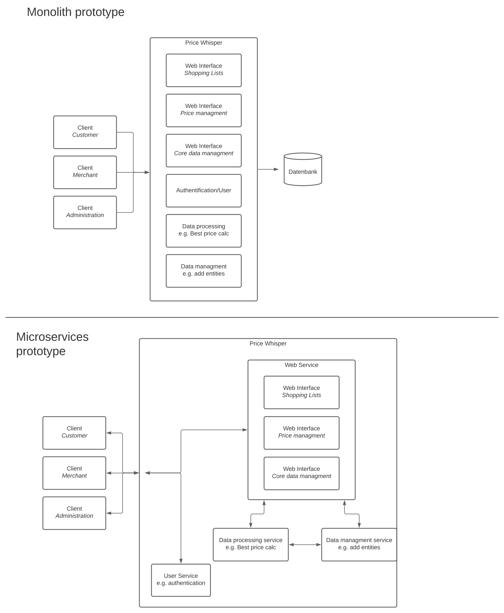

# Price Whisper

PriceWhisper is your go-to destination for effortless savings on every shopping trip. Compare prices across supermarkets, find the best deals, and save money without the noise. Unlock the power of smart shopping with PriceWhisper.

PriceWhisper is an web application designed to streamline shopping experiences. Users can input their shopping list containing various products, and PriceWhisper meticulously scans multiple retailers, extracting pricing data given merchants.

The web app then analyze this data to provide you with a comprehensive cost breakdown of your shopping list, instantly identifying the most economical merchant for your trip. 

Key features:

- **Price Comparison:** PriceWhisper allows users to compare prices across multiple merchants.
- **Identifying Economical Merchants:** PriceWhisper instantly identifies and highlights the most economical merchant for each item on the user's shopping list and the complete shopping
- **Efficiency:** The platform streamlines the shopping experience, improving efficiency and reducing the effort required to find savings.
- **Data Aggregation:** The database aggregate pricing data from various merchants for one product.

## Prototypical architecture

## Authors

Dorien Grönwald
dorien.groenwald@stud.hs-flensburg.de
Hochschule Flensburg

Philipp Borucki
philipp.borucki@stud.hs-flensburg.de\
Hochschule Flensburg

Jannick Lindner
jannick.lindner@stud.hs-flensburg.de\
Hochschule Flensburg

## \<Add more sections here\>
