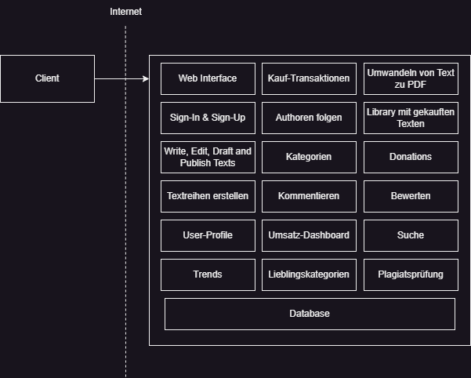
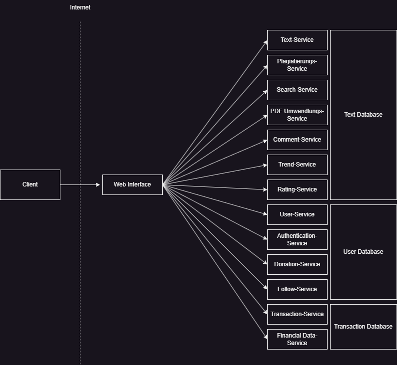

# Aufgabe 1: Research

1. Betreiben Sie Recherche über Monolithen und Microservices. Versuchen Sie diese beiden Softwarearchitekturen zu verstehen und Vergleichen Sie sie.
2. Das Arbeiten mit Microservices schließt die Verwendung Monolithen nicht gänzlich aus. Recherchieren Sie über den Monolith-First-Ansatz und dessen Vorteile.

# Aufgabe 2: Architecture Design

1. Überlegen Sie sich eine Architektur für Ihr Projekt und stellen Sie entsprechende Komponenten und deren Beziehungen in einem Diagramm dar. Arbeiten Sie dabei nach dem Monolith-First-Ansatz.
   
2. Überführen Sie den Monolithen aus 2.1 nun in eine Microservice-Architektur. Stellen Sie sicher, dass jeder Microservice maximal eine Aufgabe innerhalb der Architektur übernimmt. Erstellen Sie auch hier ein entsprechendes Architekturdiagramm.
   
3. Dokumentieren Sie beide Architekturen. Gehen Sie vor allem auf die Komponenten (Microservices, Klassen, etc.), deren Aufgaben und Beziehungen ein.

#### Text-Services

- Text-Service: Schreiben, Editieren, Draften und Publishen von Texten.
- Plagiats-Service: vor dem Publishen eines Textes wird eine Plagiatsprüfung unternommen.
- Search-Service: Mit diesem Service lassen sich Texte anhand verschiedener Kriterien suchen.
- PDF-Service: hier wird ein Text zu einer PDF umgewandelt und zum Download bereitgestellt.
- Comment-Service: Ein Nutzer kann Texte kommentieren.
- Rating-Service: Texte können von Nutzen bewertet werden.
- Trend-Service: Anhand von ausgewählten Kategorien und der Beliebtheit werden Texte zurückgegeben.

#### Transaction-Service

- Es ist möglich eine eigene Währung mit Echtgeld zu kaufen
- Mit dieser Währung können die einzelnen Texte gekauft werden (User-Service)
- Autoren können mit der Währung auch Spenden erhalten (Donation-Service)

#### Financial Data-Service

- Zeigt an wieviel man verdient hat im laufenden Monat
- Vergleich des Verdienstes zu anderen Monaten

#### Authentication-Service

- User-Account erstellen, Einloggen, Ausloggen, Passwort ändern

#### User-Service

- User-Profil verwalten: Namen, Profilbild, Profiltext, Alter, E-Mail

#### Follow-Service

- Lässt einem User folgen, damit Publikationen von diesen auf der Hauptseite im Dashboard angezeigt werden.
- Darstellung auf User-Profil, wer einem folgt und wem man folgt

#### Donation-Service

- Ermöglicht das Spenden auf User-Profilen, ohne etwas zu kaufen. Text kann dazugeschrieben werden. (Hängt mit Transaction-Service zusammen)

# Aufgabe 3: Project initialization

1. Erstellen Sie einen Fork von dem Repository https://github.com/flohansen/hsfl-master-ai-cloud-engineering und bearbeiten Sie die README.md.
2. Fügen Sie alle Gruppenmitglieder zum GitHub-Projekt hinzu und geben Sie Ihnen die Rolle Admin oder Write.
3. Erstellen Sie entsprechende Unterprojekte für Ihre Microservices und fügen Sie jeweils eine README.md hinzu, welche die Komponente erläutert. Nutzen Sie dafür Ihre Dokumentation aus 2.3
4. Synchronisieren Sie remote mit local mittels eines push Befehls. Achten Sie auf die Konventionen für Commit-Messages in den Hinweisen.
